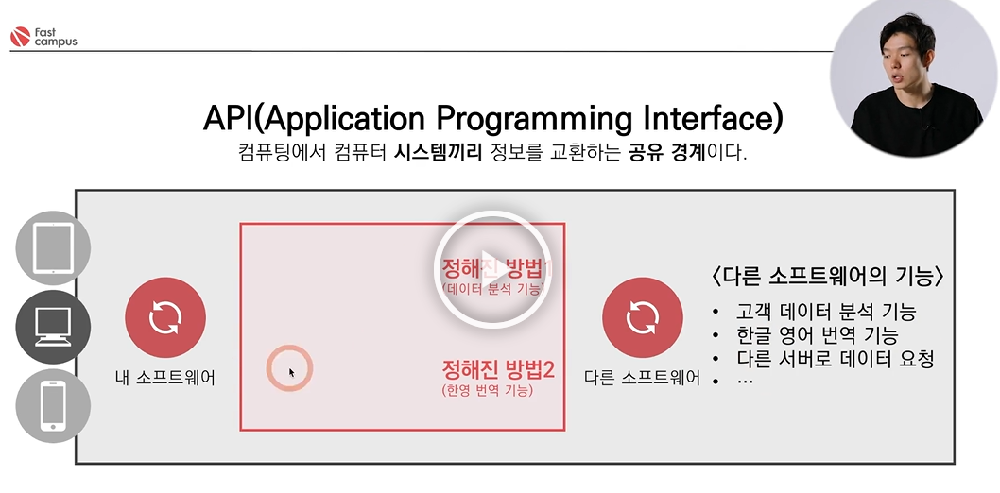
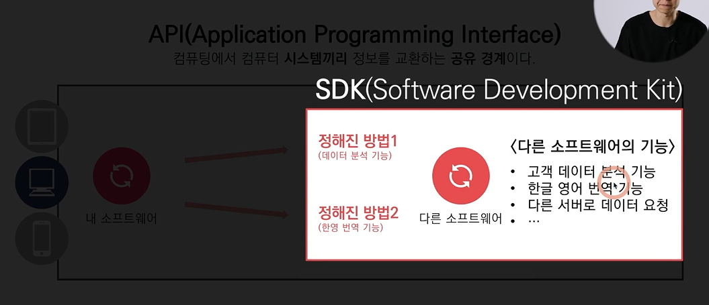

# Ch 03. API & JSON
#### 개인서버를 운영하면 힘든 이유
1. 전원 이슈 - 서버 컴퓨터의 주요한 스펙 중 하나는 '전기세'
2. 컴퓨터 또는 하드디스크 고장날 경우, 데이터 손실 및 서비스 중단의 피해

-> 서버 컴퓨터를 대여해주는 상품을 판매하는 업체 등장 
- 종류: Gabia, cafe24, Amazon의 AWS(Amazon web services)) 
- 특징: 업체에 서버 컴퓨터를 대여, 그 컴퓨터는 그 회사가 알아서 관리
  - AWS: 
    1) 컴퓨터, 하드디스크, 데이터베이스, 미디어, 모바일을 **빌려주는** 등 다양한 서비스 제공하기 때문에 효과적으로 서버 구축할 수 있음
    2) 서울 대림에 있는 서버 컴퓨터를 서버 개발자가 조작하기 위해 **원격제어**를 함

#### 원격제어
- 아마존에서 제공하는 특정한 key 파일을 이용하여 컴퓨터에 원격으로 접속 가능
- 대부분의 서버 컴퓨터는 그래픽 UI가 없는 환경 
- command line interface에서 명령어, 키워드로 리눅스를 조작할 수 있음(**리눅스 키워드**)
---
## API(Application Programming Interface)란?
- 클라이언트의 각각의 요청을 구분할 수 있는 **체계** (<u>a 프로그램이 b 프로그램에게 기대하는 미리 약속된 동작들</u>)
- 서버 컴퓨터는 비디오 파일 보내주는 기능, 이미지 파일 보내주는 기능, 로그인 처리해주는 기능, 회원가입 처리해주는 기능 등을 가지고 있음
- 서버 컴퓨터에 비디오 파일 받을 때 요청 보내는 곳(주소), 이미지 파일 받고 싶을 때 요청 보내는 곳(주소) 등 **주소를 나누어 놓음**

### 1) 클라의 관점
e.g) "타임라인에 사진을..."

> [클라가 보내는 **요청**]
>- **C**reate(올려줘) 서버컴퓨터의 IP주소/timelinecreate
>- **R**ead(불러와줘) 서버컴퓨터의 IP주소/timelineread
>- **U**pdate(바꿔줘) 
>- **D**elete(지워줘)

- 기획자는 기획 과정에서 **CRUD**에 대해 고민해야 함(관리자 페이지 등 빠트리지 않고 기획해야 함)
- 요청을 할 때는 데이터를 집어넣을 수 있는 '공간'이 필요 = **request**
- 서버 개발자마다 주소를 마음대로 짓게 되면 위험하므로 체계적으로 주소 시스템을 만들 필요가 있음
-> CRUD 관점으로 **주소를 하나로 통일시킴** (e.g. 서버컴퓨터 IP주소/timeline**s**(자원의 복수))

> [클라가 보내는 **요청**(주소 통합)]
>- **C**reate(올려줘) = POST
>- **R**ead(불러와줘) = GET
>- **U**pdate(바꿔줘) = PUT(전체)/PATCH(일부)
>- **D**elete(지워줘) = DELETE  
> -request 비닐봉지에 post 등의 스티커를 붙임

### 2) 서버의 관점
e.g) "가입된 사용자인가?, 비밀번호가 틀린데.. 등"을 고민한다 = 서버 컴퓨터에 프로그램이 동작한다
- 응답 2가지 
   - 잘 됐어 = 200번대
   - 잘 안됐어 = 400(클라(너)가 요청을 잘못 보낸 것 같아), 500번대(명백하게 서버에서 에러났을 때)

> [서버가 클라에게 **응답**]
> - 서버 컴퓨터가 클라이언트 컴퓨터로 필요한 데이터를 Response에 담아서 보내줌
> - response도 비닐봉지
---
### UI(User Interface): 유저와 컴퓨터 사이
- 인터페이스: 정보를 교환하는 공유 경계
- e.g) 앱이나 웹 상의 기능(로그인, 명암 조절, 검색, 투표 등)과 유저 사이에 인터페이스가 필요함
  - UI: 검색 텍스트 필드, 로그인 버튼, 명암 슬라이더, 체크박스 등
  - UI는 클라이언트 개발자가 만들고, 유저는 그걸 사용함

### API(Application Programming Interface): 컴퓨터와 컴퓨터 사이
- 의미: 컴퓨팅에서 컴퓨터 **시스템(소프트웨어)끼리** 정보를 교환하는 **공유 경계**
- 원리: 
   1) 유저가 로그인 버튼을 누르면 클라이언트 컴퓨터가 서버 컴퓨터로 로그인 요청을 보냄
   2) 서버 개발자가 API의 기능들을 만들어서 API를 정의해주고, 클라이언트 개발자는 API를 사용함
   3) 함수와 같다고 볼 수 있음
- 서버 컴퓨터의 다양한 기능: 로그인, 회원가입, 타임라인 글쓰기, 블로그 카테고리 불러오기 등
- 구성: **서버 주소/A**
- 핵심 용어
  - **파라미터(=요청 변수)**: 클라이언트가 서버로 요청을 보내는 데이터들 (예를 들어, 덧셈함수에 넣는 값, 로그인 메서드에는 아이디와 비밀번호)
  - **메서드**: (앞서 POST, GET, PUT, PATCH, DELETE 스티커를 붙여서 보낸다는 의미, 스티커와 같음)

### SDK(Software Development Kit)

- 소프트웨어가 서버, 클라이언트와 같이 다른 컴퓨터에서 사용하는 경우도 있지만, 한 컴퓨터 안에 여러 소프트웨어를 사용하기도 함 
- 내 컴퓨터 안에서 내 소프트웨어와 다른 소프트웨어가 있을 때, 다른 소프트웨어의 기능을 쓰기 위해 '정해진 방법'으로 **요청**을 보내면 처리하고 **응답**을 줌 
- e.g) '타다'라는 어플리케이션: 구글 지도 sdk를 설치해서 sdk가 지도 서비스를 사용하기 위한 모든 기능을 제공, 지도 위에 핀을 꽂고 싶을 때는 구글 지도가 제공해주는 API를 사용하면 됨 

---
### JSON
- 의미: 요청과 응답을 주고받을 때의 형식(비닐 봉투 내용물의 형식과 유사)
- 클라이언트와 서버는 요청과 응답을 주고받고, 요청과 응답 안에는 데이터가 들어감
  
---
### 정리
- 클라이언트 컴퓨터 안에는 하드웨어가 있고, 하드웨어에 대표적인 4개의 OS를 띄움 
- OS 위에 **클라이언트 프로그램**을 돌림(카카오톡, 어플리케이션, 응용프로그램 등)
- 서버 컴퓨터에 많이 사용되는 OS(Ubuntu라는 리눅스)
- OS 위에 **서버 프로그램**을 돌림
- 중간에 네트워크를 통해서 클라이언트 프로그램은 서버 프로그램에 요청을 보냄
- 클라이언트 개발자와 서버 개발자는 'api'라는 체계를 통해 일을 함
- api를 만드는 사람은 서버 개발자, 쓰는 사람은 클라이언트 개발자
- JSON: 요청과 응답을 주고받는 데 들어가는 데이터의 형식으로 가장 많이 쓰임
  - 파일의 확장자의 형식이기도 함 (~.JSON이라는 파일을 주고받음)
---
### API 문서
- 서버 개발자가 남긴 API 문서를 보고 클라이언트 개발자는 정해진대로 요청을 보내고 응답을 받아서 결과를 클라이언트 사이드에서 처리함
- 오픈 API: 많은 기업들이 자신의 서버에 있는 기능을 오픈해 놓음 

### 에러 코드
1) 200번대: 성공
2) 400번대: '클라이언트 잘못'이라는 서버의 응답/ 404: Not found

3) 500번대: '서버 잘못'

