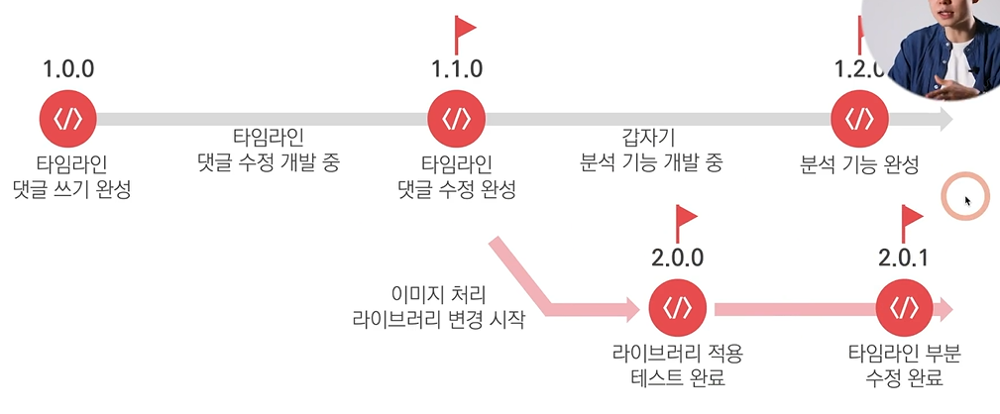
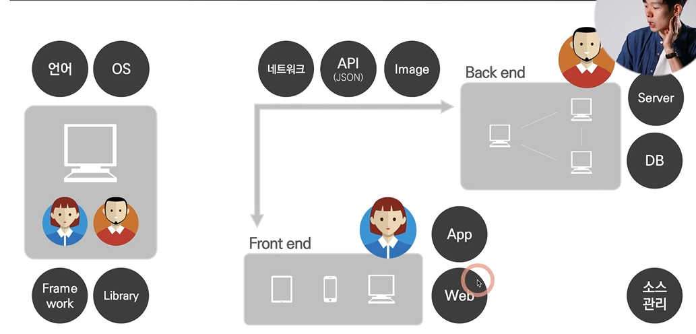

# Ch 09. Git
- 소스 관리
- 코드 변화의 과정을 저장해서 소스 코드들을 넘나들 수 있음
- **소스 코드의 버전 관리 기능**: git의 가장 중요한 기능
- 용어
  - **commit**: 깃발을 꽂는 행위/ commit log를 남김(개발의 흐름을 알 수 있음)
  - **branch**: 새로운 기능을 위한 가지치기
  - **merge**: branch들 합쳐서 하나의 결과물로 만들기/ 그 과정에서 conflict 일어날 수 있음(충돌나는 어떤 코드가 맞는지 확인하도록 함)

- git의 두번째 중요한 기능: 협업 시, 공유 저장 
- github, bitbucket 등의 서비스: 원격 저장소에 완성된 결과물 관리
- 관리하기 위한 행동 2가지
  - **push**: 나의 commit의 결과물을 원격 저장소에 올리기 (소스 코드 올리기) 
  - **pull**: 원격 저장소의 다른 사람들이 만들어 놓은 결과물을 당겨오기 - 그 최신 버전 위에서 내가 작업하기 (내 컴퓨터로 소스 코드 내려받기)

<part2_총정리>
