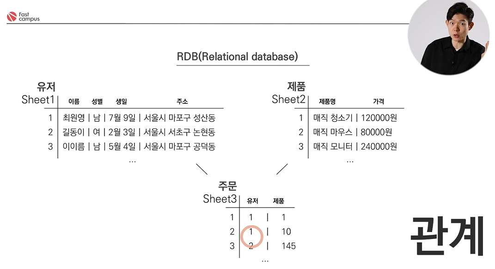
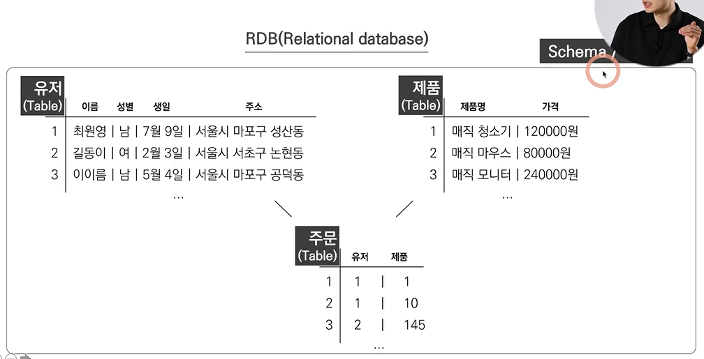
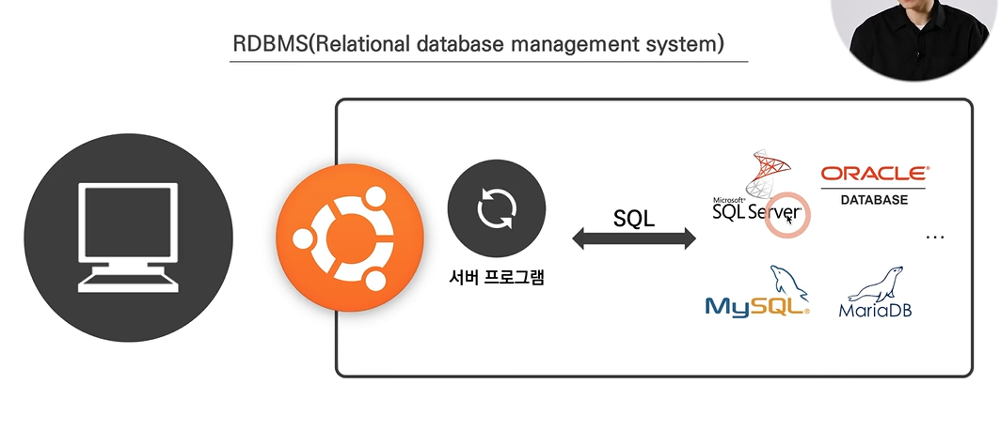
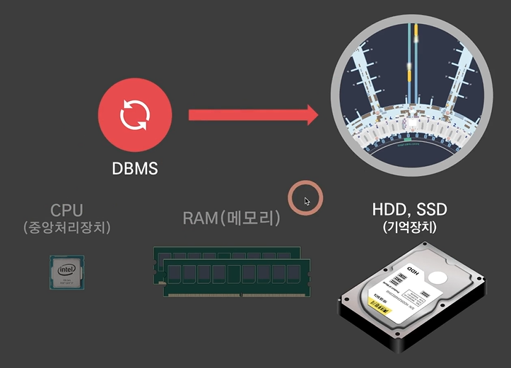

# Ch 06. 데이터베이스(DB)
### 데이터베이스가 어려운 이유
- 데이터베이스의 무결성: 단 1%의 에러도 용납되지 않음
- 속도가 빨라야 함

### 관계형 데이터베이스(RDB)-Relational database
- 대표적인 관리 방법론
- 엑셀과 유사
- 관계를 맺어서 sheet를 만듦
- 이점: 성별을 바꿀 경우, sheet1에서만 수정하면 됨(연산 속도가 빨라지고, 에러가 날 확률도 적어짐)
- 특성: **구조**를 짜지 않으면 데이터를 넣을 수 없음(구조: 이름, 성별, 생일, 주소 등) / 수정하려면 구조를 다시 짜야 함
- 기획자는 데이터를 수정을 하고자 한다면 바꿀거리를 **한번에, 빈번하지 않게** 요청해야 함(기획자도 보수적으로 데이터베이스를 바라봐야 함)

[용어]
- 엑셀의 sheet = RDB의 table
- 엑셀의 파일 1개 = RDB의 Schema 또는 Database

### RDBMS-Relational database management system
- 의미: 데이터 수정 등을 사람이 직접 하지 않고, 프로그램에게 대신 맡기는 데 이에 해당
- 소프트웨어 종류: MySQL, ORACLE database, Microsoft SQL, MariaDB
- DBMS: 데이터를 관리해줌/ 알아서 CRUD 파일관리함
- 작동 원리:
   - 서버 컴퓨터의 OS 위에 서버 프로그램이 올라가고, DBMS라는 프로그램이 올라감(1~2개의 프로그램이 회사 전체의 데이터 관리)
   - 서버 개발자는 서버 프로그램을 만들어서 DBMS에게 데이터를 CRUD 하도록 요청(DBMS에게 **요청만 하면됨**)
- 요청할 때 쓰는 언어: **SQL**(Structured Query Language) - SQL을 알면 DBMS에게 일을 부탁할 수 있음

---
#### 데이터 저장 방식
1. 데이터가 저장되는 장소는 하드디스크 
2. DBMS(소프트웨어)는 메모리 위에서 CPU(중앙처리장치)가 돌림 
3. DBMS는 하드디스크로 데이터를 집어넣음
4. CPU, RAM, 보조기억장치가 있는 곳이라면 어디든 DBMS를 쓸 수 있음 -> 클라이언트 컴퓨터와 서버 컴퓨터 모두 가지고 있으므로 DBMS를 돌릴 수 있음 -> 데이터가 클라에 있을 수도, 서버에 있을 수도 있음을 의미

e.g) 
   1. 알람앱의 모든 데이터는 네트워크가 필요 없음/ **클라이언트**에 있는 데이터 
   2. 페이스북 게시글에 대한 데이터는 페이스북의 서버 DB에 해당 데이터가 이동/ **서버**에 있는 데이터 
   게시글을 볼 수 있는 이유: 페이스북이 가지고 있는 서버 DB에 이 글이 들어가 있기 때문

#### * 기획자는 어떤 **데이터가 클라에 있는지 서버에 있는지를 구분**할 수 있는 눈을 키워야 함
- 구분해야 하는 이유: 기획자가 특정 부분을 수정하고자 할 때, 누구에게 요청해야 하는지가 나뉨
- 주요 용어:
   - **로컬, 내부DB, 네이티브, 클라/클라이언트, 프론트, 프론트앤드**: 클라이언트에 있는 데이터  
   - **서버, API요청**에 의해 가져온 데이터, **(그냥)DB, 백/백앤드**: 서버에 있는 데이터
