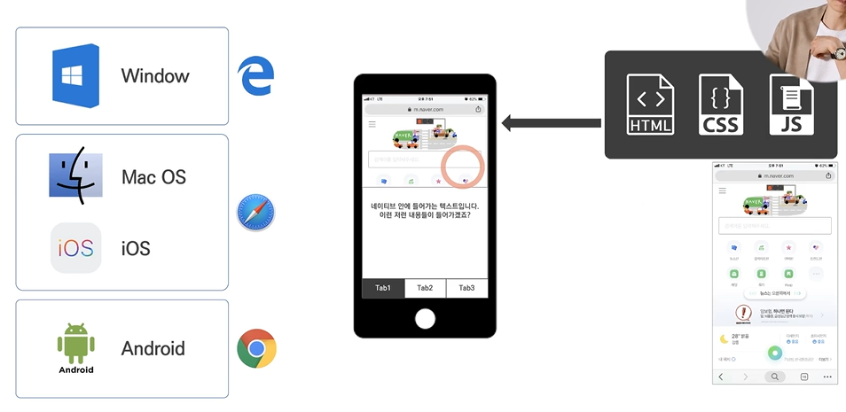

# Ch 04. 애플리케이션

- 버전: e.g) 1.0.0 또는 2.0.0 맨앞의 숫자가 바뀌는 경우는 큰 변화, 업데이트를 강제하도록 기획할 수 있음
- **버전의 파편화**: 사람들마다 쓰는 버전이 다 다를 수 있음(버전 업데이트를 사용자가 선택함으로써 누구는 새 버전을 써고 누구는 이전 버전을 쓰는 현상)
- **모바일 애플리케이션**의 경우, 마켓이 잘 발달되어 있음(애플의 앱스토어, 구글의 플레이스토어)
- 개발의 결과물의 끝에는 '**심사**'가 있음 -> **심사에 대한 고려**가 반드시 필요함
  - 애플: 앱 심사를 통해 정책에 맞지 않는다고 판단되면 reject을 함 -> 앱의 성능이나 법적인 이슈들이 보장됨(수정 또는 내용 증빙시 다시 올릴 수 있음)
  - 구글: 자율성을 보장하며 심사가 까다롭지 않음. 사후 처리하는 경우가 많음 -> 앱의 양은 많지만 질이 떨어지는 경우가 있음

---
# Ch 05. 웹
## 01. 웹의 기본
<Web 세상>
### 1. 웹의 기본(HTML, CSS, Javascript) '웹 클라이언트'라고 부르는 이유는?

- **HTML**(Hyper Text Markup Language): 문서 작업하기 위한 언어, 프로그래밍 언어는 x, 어떤 컴퓨터에서든 공용적으로 쓸 수 있는 문서 타입(지식을 공유하기 위한 기능들, 문서작업을 위한 태그들),디자인 기능은 없었음/ HTML작업자=마크업하는 사람 
- **CSS**: 프로그래밍 언어는 x, 디자인을 입히기 위한 언어(문서의 레이아웃, 컬러, 배치 등을 바꿔줌)
- 퍼플리싱(퍼블리셔): HTML과 CSS 작업을 합쳐서 부름
- **Javascript**: 프로그래밍 언어(컴퓨터에게 일 시키기 위한 언어)
  - HTML 문서에 CSS와 JS가 입혀짐 -> 디자인적으로 완성도 있고, 기능을 갖추게 되는 구조
  - e.g) 네이버에서 a를 치는 순간, **JS가 이를 포착하고 네이버 서버로 GET 요청을 보내서 데이터를 받아옴**(a에 대한 검색어 추천 목록을 보내줘(불러와줘)라는 read 요청을 보냄(get 메서드))
  - jSON에 있는 데이터를 가공해서 HTML로 만드는 작업을 JS가 함
- <결론>
  - HTML(뼈대), CSS(디자인), JS(기능)
  - 세개를 구성하는 원본은 서버에 있음
  - 클라이언트에서는 네이버 홈페이지의 HTML, CSS, JS 등이 다운로드 (사본)
  - 웹은 클라이언트 개발자가 만듦 
  - 웹 클라이언트: 최종적으로 시행되는 마지막 공간은 클라이언트이기 때문

### 애플리케이션과 웹의 차이점
1) 애플리케이션: 
   - 완성된 원본을 내 컴퓨터로 **다운로드 받아서 설치** 후 실행 파일로 남고 그 파일을 계속 실행/ 수정하려면 설치파일을 업데이트하고 사용자가 직접 업데이트해야 함
   - 이미 다운로드받고 실행시키기 때문에 네트워크의 영향을 덜 받음 
2) 웹:
   - 다운로드를 계속 받음/ 수정 시 원본을 바꾸면 새로고침하면 바뀐 원본으로 사본을 다운로드 받음(바꾸기가 앱보다 용이)
   - 네트워크가 안 좋은 환경에서는 사용성이 떨어짐
---
## 02. 웹 브라우저
- 5대 브라우저 종류: 크롬, 익스플로러, 파이어폭스, 오페라, 사파리
- 공통1: 윈도우(OS) 위에서 브라우저(어플리케이션)를 다운로드 받아서 설치 => 브라우저=어플리케이션
- 공통2: 윈도우(OS) 위에서 브라우저(어플리케이션)가 돌아가고 그위에서 HTML, CSS, JS가 돌아가는 구조
- 브라우저의 특징: 버전을 가짐 
- 문제점: 옛날 언어들은 점차 안 쓰이고, 사용자들은 서로 다른 브라우저 버전을 사용함  
-> '**버전의 파편화**'라는 문제가 생김 

[버전의 파편화 참고 자료](https://caniuse.com/)  
-> 각각의 버전을 맞춰보자는 논의를 개발자와 기획자 등이 함께 해야 함
---
## 03. 반응형 웹
- 아래는 모니터 환경에서 세팅된 웹이 모니터 이외의 다른 기기들을 만났을 때 생기는 문제들 

  -> **반응형**으로 극복
- 의미: 브라우저의 가로 크기에 반응해서 콘텐츠가 바뀌는 것
- [반응형웹 참고 자료](https://getbootstrap.com/) 
: 가로 사이즈가 해당 픽셀에 들어왔을 때, 모양이 바뀌도록 CSS 코딩을 각각 한 것 -> 시간이 더 걸리고 더 비싸다는 특징
---
## 04. 하이브리드 어플리케이션
1) 의미: 웹과 어플리케이션을 모두 쓰는 어플리케이션 
2) 각 OS 위에 브라우저를 내장시켜서 출시 -> 개발자들의 개발 방식이 달라짐 
3) 어플리케이션 만드는 방법: 네이티브 어플리케이션 = OS 바로 위에 돌아가는 어플리케이션(OS에서 제공하는 기술들을 가져다가 디테일을 바꿔서 앱을 만듦)
4) 2번에 의해 특정 부분에 브라우저를 올릴 수 있게 됨(서버에서 HTML, CSS, JS를 불러와서 보여줄 수 있다는 의미)

5) 웹을 수정하고자 할 때: 서버에 있는 원본을 고치면 됨, 새로고침하면 바뀜(웹은 **웹 클라이언트 개발자**가 개발해서 서버 위에 올려놓음, 서버 개발자 X)
6) 탭바 개수 수정 등 앱을 수정하고자 할 때: 어플리케이션 개발자가 바꿔서 배포한 후 사람들이 업데이트하면 바뀜

<웹과 앱의 차이>

<모바일 사이드>
- 어플리케이션 세 종류
  1) 네이티브 어플리케이션: OS 위에 올라가는 기능을 써서 만든 어플리케이션
  2) 모바일 웹 앱: 브라우저 위에 올라가는 웹 서비스
  3) 하이브리드 어플리케이션: 브라우저와 네이티브의 기능이 섞여 있는 어플리케이션
