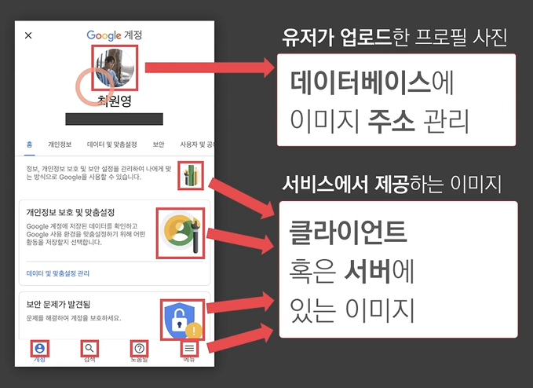
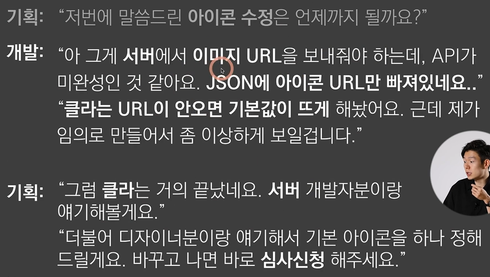

# Ch 07. 이미지 처리
### 이미지: 가장 많이 수정하는 요소
- 이미지를 **추가, 수정**하기 위해서는 이미지가 있는 **위치와 주소**가 중요함
>[이미지가 있는 **위치**]
>- 클라에 있는 이미지
>- 서버에 있는 이미지
>- 다른 곳에 있는 이미지  
>-> 이미지는 **모두 주소를 가짐**

>[이미지가 있는 **주소**]
>- 클라 프로그램
>- 서버 프로그램
>- **DB(중요)**

e.g) 
1. 유저의 프로필 사진
- 개인 이미지와 계정이 관계를 맺고 있음 -> DB에 넣어서 관리
- ㅇㅇㅇ이라는 1번 유저가 1번 이미지를 가짐, 1번 이미지의 주소는 ~ 이다 식으로 DB에 넣어서 관리
- [결론] 서버나 다른 곳에 이미지를 저장하고, 그 주소를 DB에 넣어 놓음
2. 서비스에서 제공하는 이미지
- 탭바 등의 이미지는 서버나 클라에 있음 

- 관리하는 방법:
  - 클라: 그냥 가져다 씀
  - 서버: 주소만 알면 가져다 쓸 수 있음
  - 특정 이미지의 경우, DB에 넣어서 관리(이미지 사이에 관계를 맺고 있는 경우: 관리가 어렵기 때문에 이미지를 **DB**에 넣어놓고 관리)

>중요 포인트
>- 이미지는 클라에 있을 수도 있고, 서버에 있을 수도 있음 -> 이미지는 클라와 서버에 나뉘어져 있다는 사실을 기억
>- 어떤 이미지는 **DB**에 넣어서 관리될 수 있음

<이미지 교체 요청_예시>

- 원리: 서버에서 이미지 자체를 가져오는 것이 아니라, 클라에서는 서버에서 JSON에 넣은 **이미지 주소**를 먼저 받고, 서버에 있는 이미지를 다시 받음
