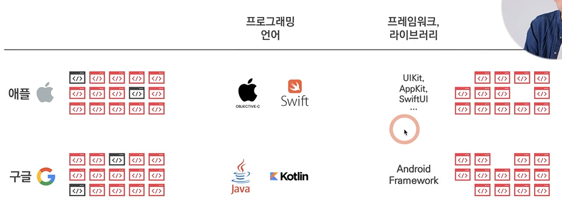
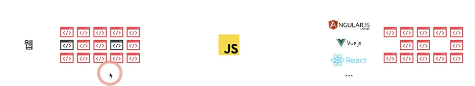
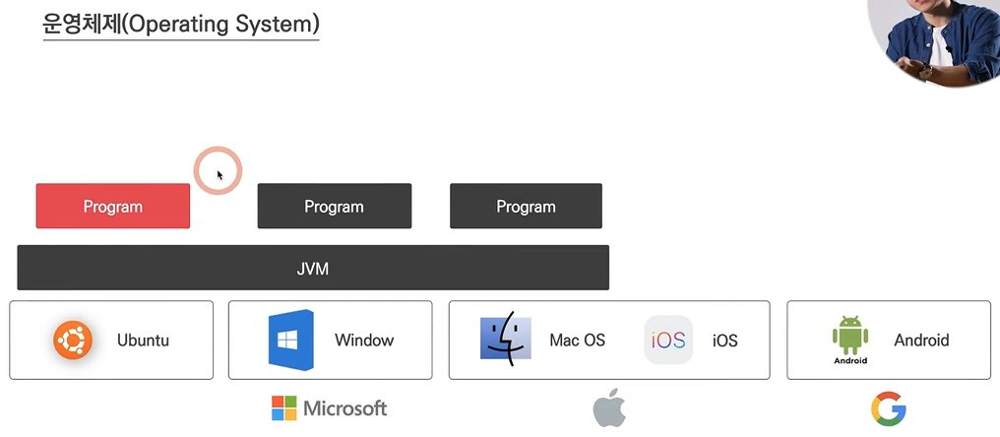
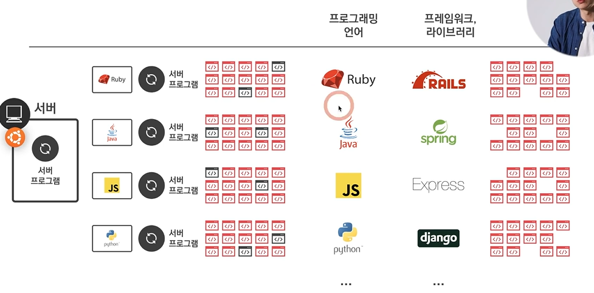

# Ch 08. 프레임워크
- 의미: **이미 만들어 놓은 소스 코드들의 집합** (비개발자는 라이브러리와 유사한 개념 정도로 이해하면 됨)
- 프레임워크에서 제공해주는 코드들을 가져다 씀 + 우리 제품에 필요한 부분(빈칸)만 만듦(화면 구성-버튼, 이미지 등)
- 프렌차이즈와 유사한 개념
### 1. 앱
  - iOS의 경우, 애플에 올라가는 앱을 만들기 위해서는 필요한 코드들을 애플이 모두 제공
  - 애플이 지정한 Objective-c, swift라는 언어를 써야 하고, 애플이 지정한 프레임워크가 있음
  - 개발자는 나머지 빈칸에 들어가는 코드만 작성하면 됨

### 2. 웹
  - 웹은 공용, 프레임워크를 민간에서 사람들이 알아서 만듦(기업 또는 개인이 만들어서 유명해지기도 함, 보통 유명한 프레임워크들은 모두 오픈되어 있음)
  - ANGULAR JS(프레임워크)는 구글이 주도, React JS(라이브러리)는 페이스북이 주도, Vue JS(프레임워크)는 중국인이 주도해서 만듦

### 3. 서버
   - 서버는 공용, 서버(컴퓨터)는 Ubuntu나 OS가 필요-OS 위에 서버 프로그램을 올림, 서버 프로그램을 서버 개발자가 만듦 
   - 아래 OS처럼, Ubuntu 위에서도 어떤 특정 프로그램을 올린다면 그 위에도 프로그램을 만들어서 돌릴 수 있음

>복습
>[OS]
>- OS의 종류가 매우 많았을 때 각 OS에 정해진 언어를 배워서, 각 OS에 올라가는 소프트웨어를 만드는 것은 어려움  
   >-> 이를 해결하기 위해 자바 같은 언어들은 **중간에 JVM이라는 프로그램을 만들어서** 그 위에 프로그램을 올리도록 함 = 개발의 새로운 패러다임
>- 파이썬, 루비 등 다양한 언어들이 이 방식으로 개발할 수 있게 만들어짐

   - 서버 프로그램: 클라에서 요청을 주면 생각을 하고 **응답**을 하는 역할
     - **다양한 언어**로 만들 수 있음
     - 언어에서 제공하는 프로그램을 설치만 하면 Ubuntu 바로 위에 올라가는 서버 프로그램이 아니더라도 서버 프로그램을 만들 수 있음
     - 프레임워크는 언어마다 정해져 있음
     

## 라이브러리와의 차이
- 프레임워크: 자동차와 유사 개념(특정 목적을 위해 **정해진 프로세스**가 있음->시키는대로 하면 개발하기 용이함, but 동시에 두 가지 프레임워크를 사용할 수는 없음)
- 라이브러리: 망치나 가위와 유사 개념(프레임워크보다 작은 개념), **자유도**가 높음, but 프레임워크보다 내가 해야 할 일이 많음