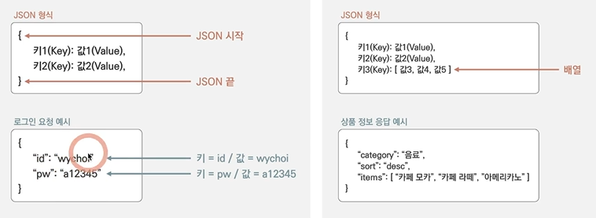

# Dicee - building apps with state

* Expanded class

1) 자동으로 리사이징하는 기능(상위 row에 들어있을 경우, 수평 공간의 최대한 가능한 크기로 리사이징, 상위 column에 들어있을 경우, 수직 공간의 최대한 가능한 크기로 리사이징)

2) 다른 expanded widget과 비교해서 얼마 만큼의 공간을 차지할 것인지 구체적으로 정할 수 있는 기능

3) expanded widget에 flex property를 추가하면 width의 비율을 조정할 수 있음

예) row의 expanded - flex : 2 / expanded - flex : 1 (가로 비율 2:1)

# To embed a widget inside another widget 
or add another widget somewhere into the widget tree

* flutter outline 의 widget tree에서 해당하는 widget 선택 후 왼쪽 아이콘(wrap with center) 클릭하면 코드 자동 생성

(해당하는 widget을 제거 후, center > child > 해당하는 widget 넣기 -> 더욱 쉽게 할 수 있는 방법)

* 해당 코드 클릭 후, 왼쪽 옆의 intention actions 버튼으로 다양하게 코드 변화를 줄 수 있음
* alt + enter
    
예) expand widget을 삭제하되 안에 있는 이미지는 그대로 둘 경우, 'remove this widget'을 클릭하면 됨

# Widget Catalog > Material Components widgets > button 

* flatbutton 사용 시, onpressed: (){}, 필요 (버튼을 눌렀을 때 반응을 넣어야 함) <- void callback
* onpressed: void callback 
  -> onpressed: (){//doSomething}

# Dart function

1) function을 만드는 방법

void getMilk(){//doSomething}
-getMilk: function의 이름
-named function = void getMilk(){//doSomething}
-function을 활성화하는 방법: getMilk();
anonymous funtion = (){//doSomething}

{} <- 사이에는 버튼을 눌렀을 때 일어나야 하는 액션이 들어감

2) function을 부르는 법

getMilk();

# Dart Variables

$ = String Interpolation

1) variable 만드는 방법 
   
var myName = 'Angela';

2) 출력하는 방법
   
print(myName); <- () 안은 value of that variable에 해당

# Dart Data Types

Dart = Statically typed language

=> dart에서는 str과 int로(또는 반대로) date type을 바꿀 수 없음 / type-safe language라는 장점

<-> Dynamically typed language는 위의 내용이 가능함 (ex. 자바스크립트)

=> statically typed language를 다이나믹하게 바꾸는 방법
: 고정된 데이터 타입을 갖지 않는 variable을 만들 수 있음

var a <- dynamic type variable

* 사용해야 할 이유가 있지 않는 한, var 또는 dynamic data type을 사용하는 것은 지양 

[primitive types]
1) string : 'Hello'
2) int(integer) : 123
2-1) double : 10.2
3) bool : True/False

# Stateful Stateless widget
-setState -> 유저 액션을 유도하는 코드(바뀌어야 하는 화면)

# Randomising the Dice (library와 random number generator 사용하기)
-사용자가 클릭 시 1~6사이의 숫자가 랜덤하게 자동적으로 나오게 하는 방법:
dart math library를 만들기

import 'dart:math';

https://api.dart.dev/stable/2.13.4/dart-math/dart-math-library.html

# Summary
1) 새 variable 생성
2) rightDiceNumber = Random().nextInt(6)+1;
3) rightDiceNumber가 언제 바뀌는지 정하기 (setState)

* 양쪽 flatbutton 중 하나만 클릭해도 양쪽 이미지가 모두 바뀌도록 하기

