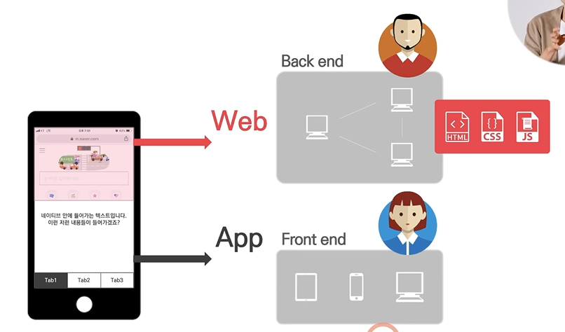

# Flutter Packages

URL: http://pub.dartlang.org/flutter

관련 자료 참고) https://flutter.dev/docs/development/packages-and-plugins/using-packages

* 사용법
1) installing 탭의 yaml 파일에 dependencies 추가
2) 우측 상단의 packages get 클릭 > 웹사이트 상의 패키지를 다운로드해서 프로젝트로 통합됨
3) external libraries에서 해당 패키지 확인 
4) import 패키기 주소 입력 

* flutter packages를 이용하는 팁
1) 패키지를 사용할 때에는 yaml 파일에서 이름 뒤의 '버전'을 적고, 버전 앞에 ^ 을 넣어서 주요 버전에만 한정되도록 한다.
(다음 버전으로 넘어갈 시에 발생할 수 있는 코드 에러를 막기 위함)
2) 사용하기 전에 READ.ME 탭의 내용을 상세히 보는 것이 좋음

* function을 활용해 반복되는 코드를 그룹화하여 정리하는 방법
1) function을 만든다 (void + function의 이름) </br>
반복되는 코드 안에서 변화를 주어야 하는 부분이 숫자라면 int + 임의의 이름 'soundNumber' 설정 </br>
2) 아래 코드에서는 반복되는 부분은 삭제하고, 해당 function의 이름 'playSound()'를 입력한다.
3) ()안에 바뀌는 숫자들을 입력한다. <br>

<참고 이미지>


# Dart Function part1 summary
1. 가장 기본적인 function 구조 </br>
function 만드는 방법: void getMilk()
function 불러오는 방법: getMilk();

2. function 안에 input 구체화하기 </br>
<예시> </br>
void PlaySound(string name) { <- ()안은 input/argument </br>
 final AudioCache player = AudioCache(); </br>
 player.play('$name.wav') <- used in the function </br>

# Dart Function part2
: input을 갖는 function 

[function 만드는 방법]
1. 'int' 등의 data type을 정해야 함
2. 'bottles' 등의 이름을 정해야 함
3. function의 마지막은 ;로 닫아야 함

<예시> </br>
void getMilk(int bottles){ </br>
   double cost = bottles * 1.5; </br>
}

[function 불러오는 방법]
1. parentheses()를 비워두지 않고, input을 입력해야 함
-> input이 function으로 흘러들어가서 (int bottles)의 bottles안에 저장됨

<예시> </br>
getMilk(2); 

void getMilk(int bottles = 2){ </br>
double cost = bottles * 1.5; </br>
}

<예시>



# Dart Function part3 
:output을 갖는 function

<오류 발생 케이스></br>
: output이 없음</br>


<수정></br>


<output 없는 케이스></br>


<output을 갖는 케이스로 수정></br>
1) void > 결과값으로 원하는 data type으로 수정
2) return 추가 (뒤에는 function의 output 적기)


[function 만드는 방법]
1. 맨앞의 int=output data type
2. (int money)=input
3. money-2=output (keyword 'return'뒤의 내용)
4. return=marks the output 


[function 불러오는 방법]</br>


# Functions Challenge
<문제와 정답>
```
void main() {
  
 int step1Result = add(n1: 5, n2: 9);
  
 int step2Result = multiply(step1Result, 5);
  
 double finalResult = step2Result / 3;
  
 print(finalResult);
  
}


int add({int n1, int n2}) {
  return n1 + n2;
}

int multiply(int n1, int n2) {
  return n1 * n2;
}
```

# Arrow Function
- arrow syntax(=>) 
1) =>를 활용해서 {}사이의 내용을 한줄로 줄일 수 있음

```
void main() {
  int result = add();
  print(result);
}

int add() {
  return 5 + 2;
}

int add() => 5 + 2;
```
2) single line of instruction일 때만 aroow syntax를 사용할 수 있음 </br>
아래 예시는 두줄이기 때문에 arrow syntax 사용할 수 없음
```
int add() {
  print('I got called.');
  return 5 + 2;
}
```
3) () 안에 input을 넣을 수 있음
```
void main() {
  int result = add(3, 11);
  print(result);
}

int add(int n1, int n2) => n1 + n2;
```