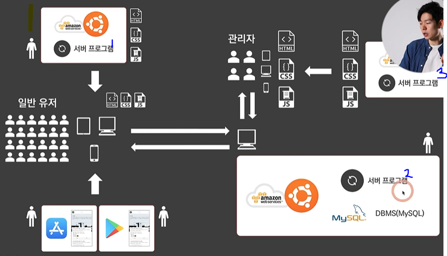
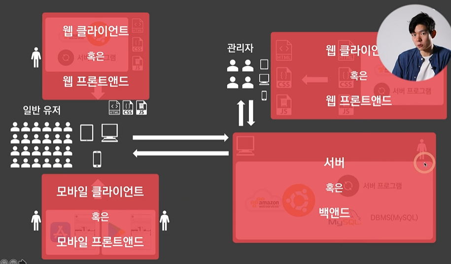

# Ch 01. 개발자의 직무 구분
[IT필수지식_추가 개념]
- 관리자 페이지(백오피스)
1) 보통 웹으로 만듦, 웹이 올라갈 서버 컴퓨터가 필요, 그 위에 서버 프로그램이 돌아감 
2) 그 위에 관리자 페이지에 대한 원본이 있고 관리자가 도메인이나 ip주소로 접속하면 사본을 보내줌 
3) 관리자는 그 사본을 다운로드 받아 자신의 기기로 그 밑에 있는 서버 컴퓨터에 접근할 수 있음 
4) 서버 컴퓨터의 DB를 바꾸면 사용자들도 바뀌어진 DB 내용을 볼 수 있음

<참고>

서버 프로그램 구분
- 1번, 3번: API를 제공하지 않음, 특정 주소로 접속했을 때 HTML, CSS, JS를 던져줌
- 서버 프로그램을 나누는 이유: 한 컴퓨터가 고장날 경우 모든 서비스가 멈추게 되므로 

<개발자 구분>

