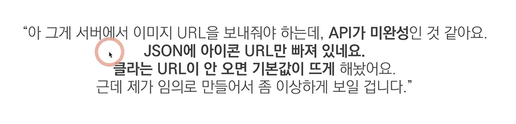
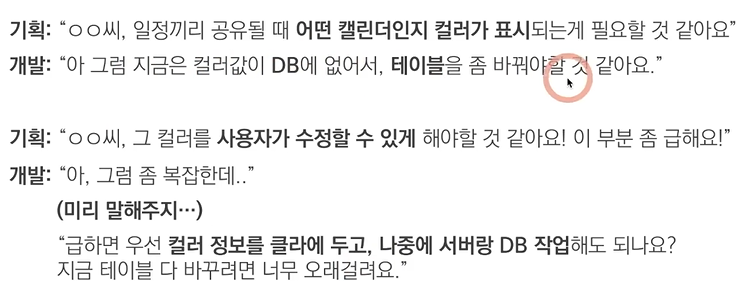
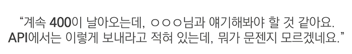
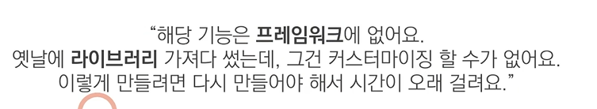

# Ch 01. 기획서에 어디까지 정리해줘야 하는걸까
"문서를 보는 사람이 **어떤 사람**일까?"

e.g)
- 새로운 아이디어 토론을 위한 문서
- 개발자에게 새로운 기획을 이해시키는 문서
- 회의에서 바뀐 내용을 정리하기 위한 문서(다시 보기용) 

#### * 필요한 것들이 필요한 만큼 들어간 문서 (필요한 부분을 focusing에서 잘 전달해주는 기획자가 좋은 기획자)
-> 스토리보드/와이어프레임의 화면설계 부분에 어떤 내용을 적고 '무엇을 빼느냐'를 고민해야 함 
e.g) 완성된 내용은 빼주고 바뀐 내용들만 더 집중해서 볼 수 있게 만들어 줄 것인가 등

---
# Ch 02. 개발자와의 대화 사례

1) 서버에서 URL 주소를 받고 이미지를 불러옴, 이미지는 바꿔서 배포해야 함

2) '컬러값'이라는 정보가 테이블에 없어서 집어넣을 수 없는 상태 -> 테이블의 구조를 바꿔야 그 안에 데이터를 쌓을 수 있음

3) 클라이언트 개발자의 말, API 문서대로 했는데 클라 문제라고 뜸

4) - 프레임워크, 라이브러리: 다른 사람들이 만들어 놓은 소스코드들
   - 프레임워크는 두 개 같이 쓸 수 없지만, 프레임워크 안에서 라이브러리는 여러 개 쓸 수 있음(중복 사용 가능)

5) "백 엔드에서 **스프링**으로 API 모듈을 만들고 있는데 트래픽 몰릴 때 처리하는 코드를 짜고 있어요."
6) "iOS와 안드로이드는 **flutter**로 만들고 있어요."
7) "우선 서버는 **API 구조**까지만 짜고, 아직 기능은 못 붙였어요." 