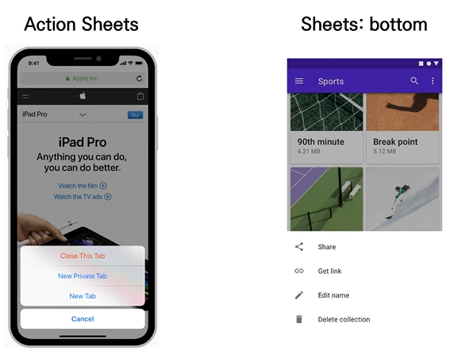

# 기능 구현에 필요한 용어
- 이미 결정되어 있는 용어 알기 
  - pxd(UI에 관한 용어), apple의 human interface guidelines, google의 material design
- 기획자가 새롭게 정의해주어야 하는 용어 정리 필요

[예시] 이미 결정되어 있는 용어인 ROLE 탭바, 결정되어 있지 않은 용어인 ROLE

[예시] apple과 안드로이드의 용어 상의 차이가 있음 

---
# 구현 - QA시 주의사항
- 개발 과정: 커뮤니케이션, 기획의 수정, 용어의 정리  
-> 기획자에게 필요한 부분: **개발에 대한 지식과 정해져 있는 용어에 대한 선행 공부**

