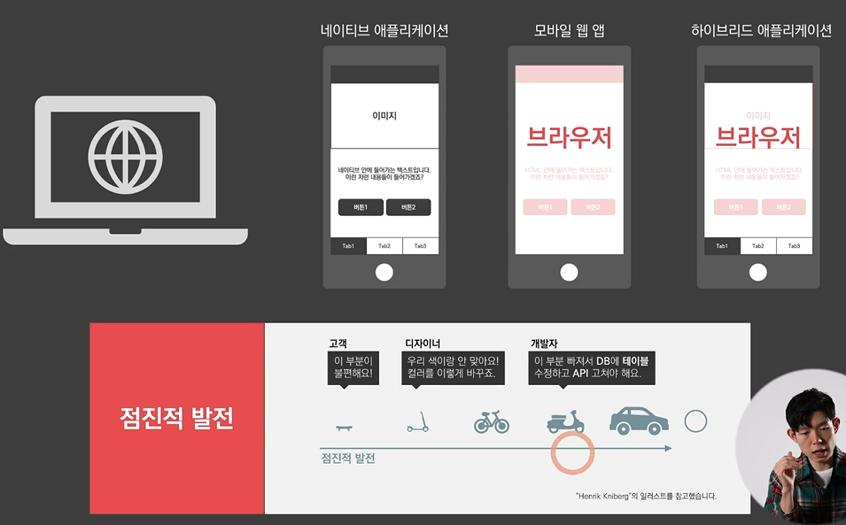
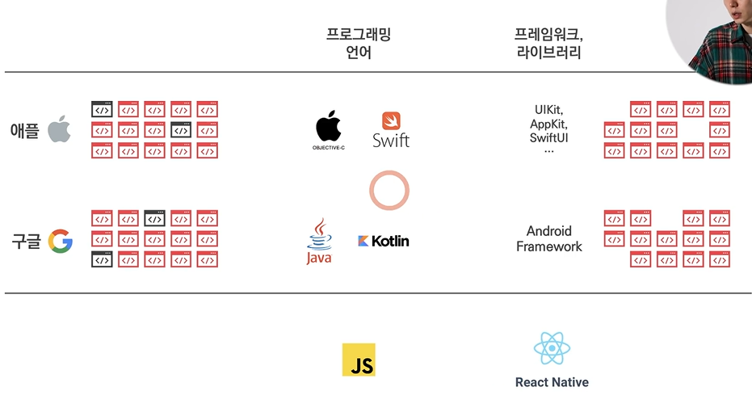
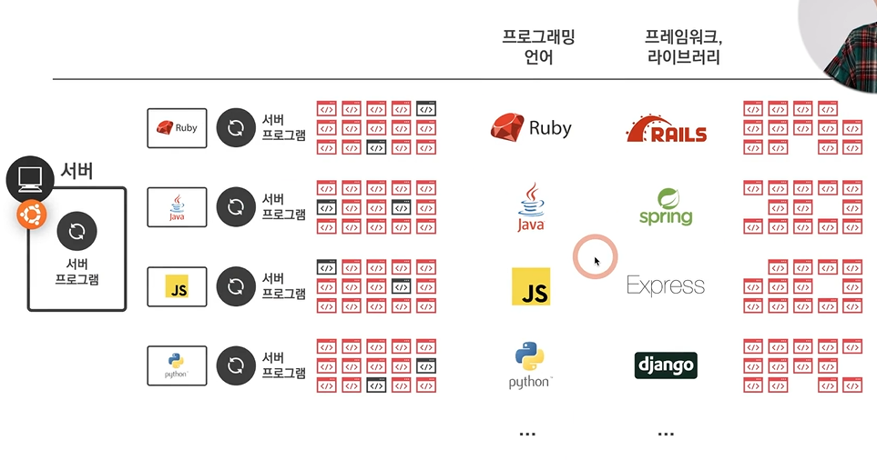

# 프로젝트 의뢰를 위한 프로그래밍 지식-외주

- 네이티브 어플리케이션: OS에서 제공하는 기능을 바로 가져다 사용(OS 바로 위에 올라가는 앱), 속도 빠름
- 모바일 웹 앱: 웹
- 하이브리드 어플리케이션: 웹과 앱의 혼합
- depths에 따라 속도 차이가 있음

- 작은 것을 만들어서 **점진적으로 디벨롭**시키는 것이 검증적인 측면이나 고객의 니즈를 맞추는 데 좋음 
- 서비스의 유용성과는 별개로, UI/UX적인 이슈가 있을 수 있음

1) 시작하기 가장 좋은 형태는 **웹** -> 웹은 모든 기기에 다 통용시킬 수 있기 때문(웹과 서버 개발자의 협업)
2) 검증을 하는 과정을 지나고 중간에 앱을 개발하는 것이 좋음

>[결론] 
- 범용적으로 사용할 수 있는 기술부터 선택하는 것을 추천
- 최대한 개발자의 수를 줄여서 하려면 '**웹**'으로 시작하는 것을 추천
- 워드프레스도 하나의 대안이 될 수 있음

---
# 외주 - 얼마나 드는가? 
- 기획 문서의 수준, 개발자의 경험 등에 따라 가격 차이가 남
- 외주 구하는 대표적인 사이트: wishket, freemoa
- **내가 만드려는 서비스와 유사한 규모의 서비스**를 찾아 기한과 가격 등을 비교해 보고 개발사와 협의
- 워드프레스도 외주를 구할 수 있음(기존 개발보다 가격이 비교적 쌈) - 하나의 대안이 될 수 있음
---
# 외주 - 어떤 기술을 선택해야 하는가?
- **언어 또는 프레임워크**를 선정하는 기준이 필요
- 기준
  - **기술**: 시장에 얼마나 많은 개발자가 있는가, 신기술 vs 옛날 기술
  - **사람**: 해당 개발자의 경험이 풍부한가, 학습이 필요한 정도는?
- 웹: 1) 프로그래밍 언어: 자바스크립트 2) 프레임워크/라이브러리: ANGULAR JS, Vue js, React js 등 
  - 웹은 현재 시장에서 어떤 **프레임워크나 라이브러리를 가장 많이 사용**하는가를 파악해야 함  e.g) 구글 검색어 순위 등
  - 내 주변의 개발자들이 많이 쓰는 기술을 알아두어야 함
- React Native, flutter를 신경써야 함 (React Native: JS에 기반해 개발을 하면 iOS 앱과 안드로이드 앱을 만들어줌, but 커스터마이징하려면 복잡하고 최신 기능을 반영하는 속도가 느리다는 단점이 있음)

[참고1]

[참고2_서버 사이드]

- JS, JAVA가 강세, Ruby, Python은 점유율이 상대적으로 낮음
