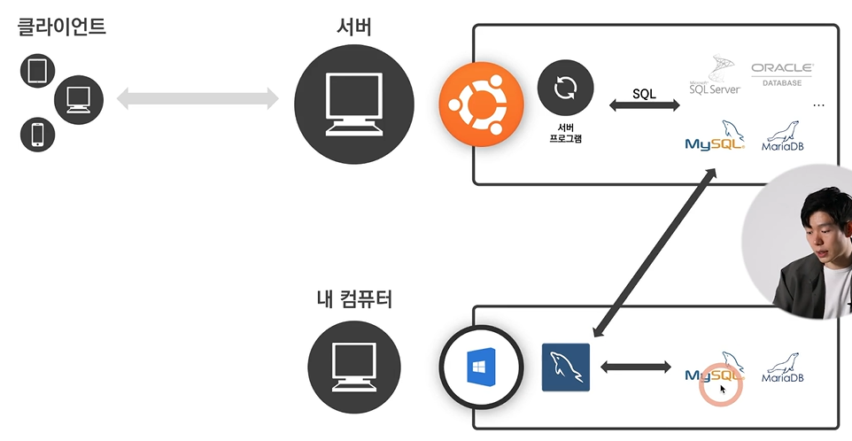
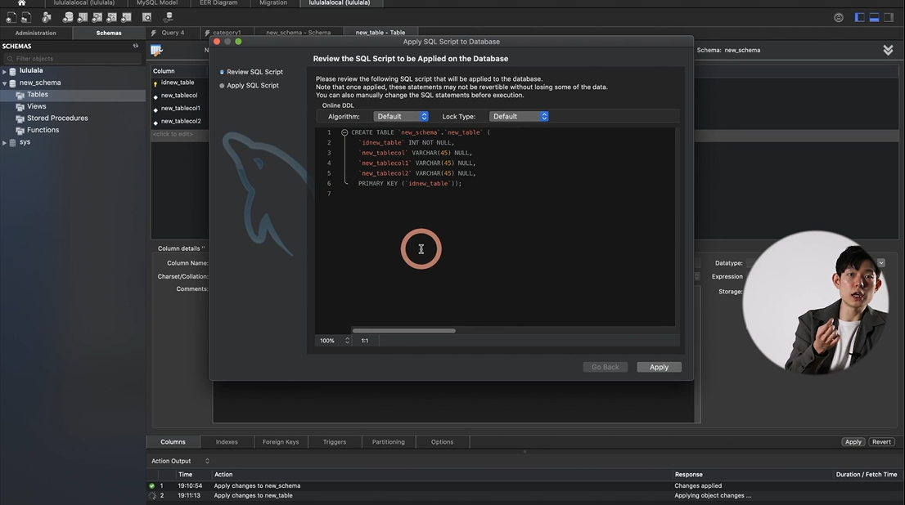
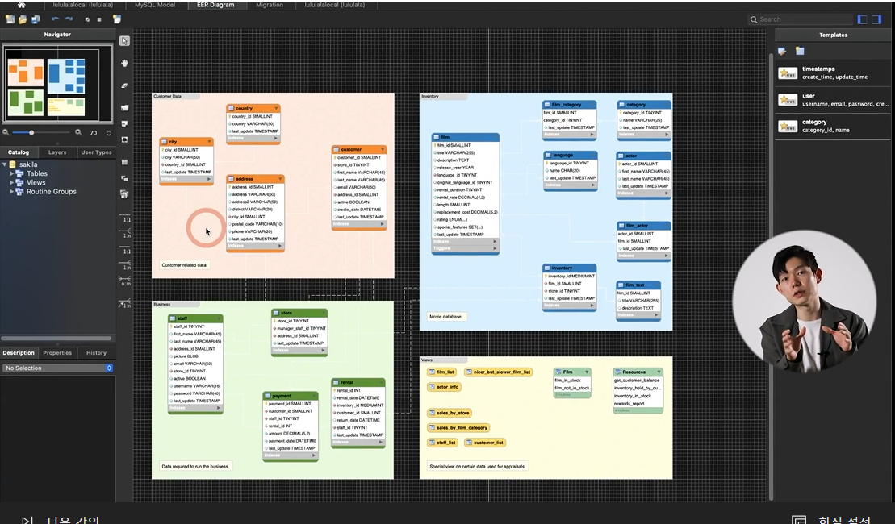
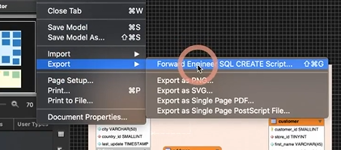
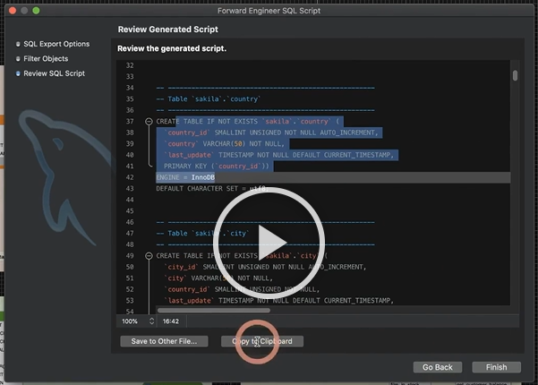
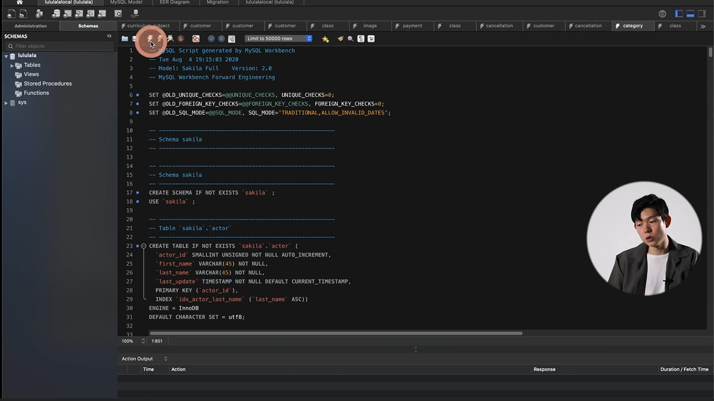

# SQL 없이 데이터베이스 살펴보는 법
- RDBMS(Relational Database Management System): 관계형 데이터베이스 관리 시스템 - 관계형 데이터베이스를 생성하고 수정하고 관리할 수 있는 소프트웨어
- Database(Schema): 엑셀 파일 하나와 유사
- Table: 엑셀의 시트
- 데이터를 **조회**만 할 수 있도록 만드는 기능을 가짐(read 권한만 부여)
- 권한을 받는 경우, **보안** 중요 e.g) AWS에서는 데이터베이스에 접근할 수 있는 ip주소를 부여
- 방법: <u>**Workbench**</u> 활용 -> mySQL, MariaDB로 접속이 가능한 앱
  - 엑셀로 import, export하는 기능 -> 모든 데이터 다운로드해서 분석 가능

- 기본 명령어를 Workbench가 알아서 만들어줌
- SQL을 모두 알지 않아도 table 안에 있는 내용을 볼 수 있음

[데이터베이스 관련 추가 공부 추천]
- '**설계**' 공부 추천
- 서로 다른 table에 중복된 데이터들이 들어가 있으면 두번 업데이트 해야 하는 등의 문제 발생
- **정규화**: 데이터베이스의 무결성 유지를 위한 기법
- ERD(Entity Relationship Diagram)을 토대로 원래는 SQL을 배워서 table을 만들어야만 가능
- but, Workbench에서는 export - create문을 만들어주는 기능 제공 (copy to Clipboard) > 붙여넣기
 
[참고]

