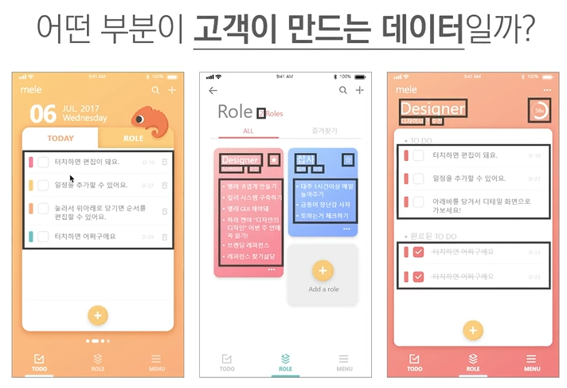

# 디자이너 편
[이슈1]
1) 일러스트레이터, 포토샵으로 작업하여 전달 - 개발자의 개발물과의 결과물이 달라 개발자와 디자이너 간의 충돌 발생
2) 아래와 같이 개발자이 구체적인 **가이드** 제공을 요청

3) 대안으로 제플린, 스케치, Xd 등장

[이슈2]
- 기기마다 디스플레이 크기와 비율이 다름 -> 적절한 디자인 반영이 필요
- 비율에 따른 구현 방식은 이미 개발자들 사이에서 통용되고 있음

---
# 프론트엔드와 퍼블리싱
[프론티엔드 사이드가 돌아가는 원리]
- 하드웨어 안의 OS 위에 올라가는 데스크탑용 프로그램 = '클라이언트 프로그램' 또는 '모바일 클라이언트/프론트엔드 프로그램'
- 그 위에 올라가는 브라우저 
- 그 위에서 HTML, CSS, JS가 작업을 통해 웹이 돌아감
- 퍼블리셔: HTML, CSS만 작업(웹 사이드에 올라가는 디자인 구현 결과물을 만듦) + 웹 클라이언트 개발자가 JS를 입혀주면 웹이 동작

---
# (디자이너 혹은 기획자가) 프론트엔드 개발자와 협업할 때 필요한 역량
- **사용자가 만들어내는 데이터**(이를 파악하는 것이 매우 중요)

1) 사용자가 만들어내는 데이터는 있을 수도 있고 없을 수도 있음  
- 없는 경우에 대해서 어떻게 보일지 기획 및 디자인을 해주어야 함

2) 사용자가 만들어내는 부분은 길 수도 있고 짧을 수도 있음  
- 아주 길게 썼을 때 어떻게 보이느냐에 대한 기획 및 디자인을 해주어야 함  
- '**사용자가 만들어내는 데이터**'에서만 나오고 '**그로 인해 바뀌는 데이터**'에서만 나오는 부분 -> **사용자의 다양한 행동들 각각에 모두 디자인 요소가 들어가 있어야 함**

3) 무슨 내용이 들어갈지 모름(강조하려면 추가적 장치가 필요함)  
- 고객이 만들어내는 데이터인 '편집'을 강조하고 싶다면 선택하는 기능 추가, 강조하는 기능 추가, 키보드 자체가 달라져야 하는 등의 이슈

[직군별 유의 사항]

> ### 정리
> **사용자가 만들어내는 데이터가 무엇인지**를 명확하게 구분할 줄 알아야 하고, 그 요소들을 기획하고 디자인 해야 함

