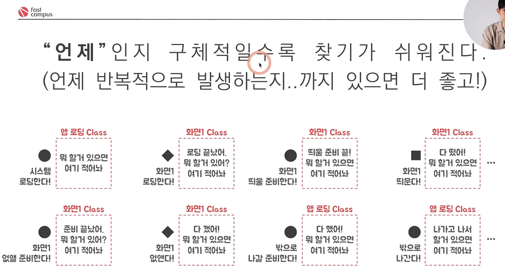
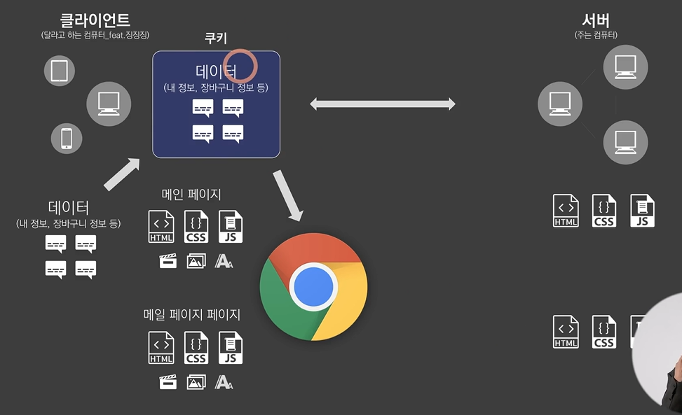

# 마케터 편 - 개발자에게 에러를 전달하는 팁
- QA는 매우 중요한 과정
- 고객이 서비스를 이용하다가 문제점을 발견 (문제의 원인은 몰라도 문제는 **프론트**에서 발견됨)
- 그 문제를 고칠 때 프론트가 어떤 고민을 하는지, 프론트가 어떻게 구성되어 있는지 등을 파악하면 '문제를 전달하는 방식에 대한 팁'을 얻을 수 있음
- 문제를 전달할 때 개발자에게 서비스 과정 중 '**언제**'인지 구체적으로 설명하는 게 중요함

---
# GA(Google Analytics)가 돌아가는 원리
- 구조: 사용자에 관한 데이터들을 구글 서버로 이동시키고, 구글 데이터베이스에 우리 회사의 고객의 움직임이 모두 담겨 있음(구글에게 대신 맡기는 것)
   - 사용자는 클라이언트에서 이벤트를 발생시키고, 이벤트는 구글 서버에 API 요청으로 전달됨
   - 쌓인 데이터들을 **GA 웹페이지**로 체계적으로 보여줌(다른 분야에 활용할 수 있도록 시각화해서 보여주는 페이지가 필요하기 떄문)
- 주로 웹 사이드에서 많이 사용(앱 사이드에서는 파이어베이스 등을 이용)
- 이때 웹 사이드에서 발생하는 문제점:
  - 같은 사용자의 데이터라고 하더라도 서버에서 이를 판단하기 어려움 -> 추가적인 정보를 제공해야 함
  - 나라는 사람의 정보(데이터)를 클라이언트 컴퓨터에 저장해 놓고, 이를 다음에 HTML 요청을 보낼 때 '**같이**' 담아서 보냄
  
  [참고]
- **쿠키**: 클라이언트 컴퓨터에 들어가 있는 작은 저장 공간(고유한 데이터 저장)

=======

