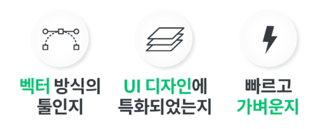

# 기획자 편-일반적인 프로젝트 진행 프로세스
1. [기획]
   - 소비자 분석
   - 스토리보드, 와이어프레임(스토리보드보다 작은 개념), UX - PPT, Xd 파일

2. [디자인]
   - UI/UX - 결과물: 제플린, 스케치, Xd, Ai, Ps

3. [개발] : 디자이너가 준 결과물을 보고 구현, 기능 입히고, 서버에 API 요청을 보내고 응답을 받아 처리
   - 실제 서비스(Web, 모바일 App)
     1. 모바일 App 
      - iOS 개발: iOS 위에 올라가는 앱 개발 
         - swift/Objective-C / cocoa framework 
      - 안드로이드 개발: 안드로이드 앱 개발
         - java/kotlin / Android framework 
     2. Web
      - 완성된 결과물이 서버에 들어감(완성된 결과물은 HTML, CSS, JS) / React.js(개발을 쉽게 도와주는 라이브러리)
      - 서버 위에 원본이 올라감, 서버는 API 서버와는 다름(**HTML, CSS, JS의 원본을 전달하는 역할**) 

   - 서버
     - ruby, 파이썬, javascript 등 / Express.js(Node.js)라는 framework
     - OS 위에 자바스크립트가 바로 돌아가지 않고, 프로그램이 필요한데 그게 Node.js, 그 위에서 자바스크립트로 서버 프로그램을 만들면 서버 프로그램이 돌아가는 방식
     - DBMS 올려놓고 DBMS에 CRUD 요청 보내기(DBMS는 컴퓨터에 같이 있을 수도 따로 있을 수도 있음)
     - **API 문서**를 만들어서 클라에 공유(API 문서의 근간이 되는 기획은 '**기능 명세서**')
   - 관리자 페이지
     - 주로 웹으로 만듦 
     - HTML, CSS, JS 완성본은 서버에 올라감
   >[클라이언트 사이드-서버 사이드 구분] 
   > 
